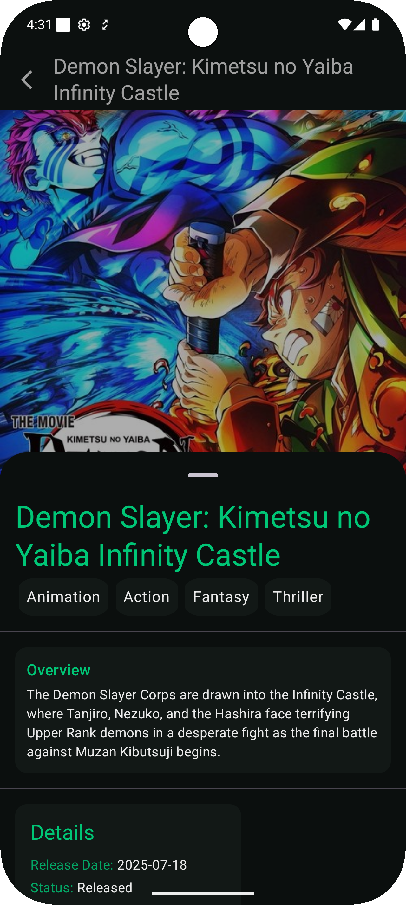
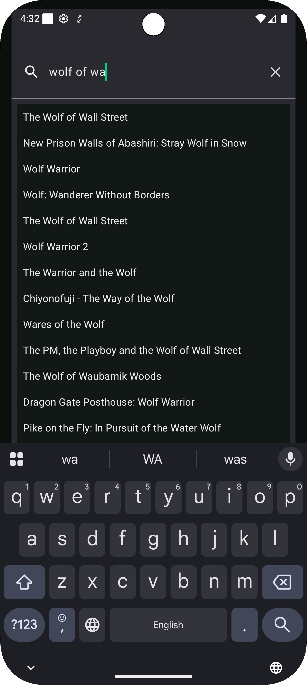

# 🎬 MovieZoneCMP

MovieZoneCMP is a **Kotlin Multiplatform** application that delivers a modern movie and TV series browsing experience.  
The app showcases a clean UI, smooth navigation, and up-to-date movie data with features like popular movies, now playing, popular series, search, and favorites.

> **Note:** The project is still under active development — screenshots below reflect the current implemented UI and design direction.

---

📱 App Design Preview
🏠 Home & Browse

Discover trending movies and shows with a clean, card-based layout.
Browse popular movies, now playing titles, and trending series with seamless scrolling.

<p align="center">   </p>
🎭 Details & Favorites

Dive deep into detailed movie information — including cast, ratings, synopsis, and watch options.
Add your favorite titles for quick access later.

<p align="center">    </p>
🔍 Search Experience

Find exactly what you want using powerful search tools — complete with genre filters, recent searches, and instant results.

<p align="center">  </p> <p align="center"><sub>*(Images scaled for clarity — actual UI closely matches these)*</sub></p>

*(Images are scaled for consistent table layout — actual UI closely matches these)*

---

## ✨ Current Features

- **Home Screen**
  - Popular Movies section
  - Now Playing section
  - Popular Series section
- **Movie Details Screen**
  - Poster, title, rating, and release year
  - Overview description
  - Cast list with images and names
  - Buttons for *Watch Now* and *Add to Watchlist*
- **Search Screen**
  - Search by movie title
  - Recent search tags
  - Filter by genre (Comedy, Drama, Thriller, etc.)
  - Search results grid
- **Favorites Screen**
  - Save movies and TV shows to a local favorites list
  - Remove items from favorites
  - Persist favorites across app launches using SQLDelight

---

## 🛠 Tech Stack

**Languages & Platforms**
- Kotlin Multiplatform (Android, iOS, Desktop)
- Swift (for iOS UI integration)
- Jetpack Compose Multiplatform

**UI & Design**
- Jetpack Compose (Android/Shared)
- Material 3 design system

**Networking & Data**
- Ktor Client – API requests
- Kotlinx Serialization – JSON parsing
- **SQLDelight** – Cross-platform database for offline storage (favorites)

**Architecture**
- MVI pattern
- Repository pattern for data access

---

## 📂 Project Structure
```
MovieZoneCMP/
├── composeApp/   # Shared Compose UI code
├── iosApp/       # iOS platform-specific code
├── core/         # Core modules (e.g., database, network)
├── gradle/       # Gradle configuration
└── README.md
```

---

## 💾 Database (SQLDelight)

The app uses **SQLDelight** for:
- Storing and retrieving favorite movies/TV shows
- Generating type-safe Kotlin database APIs
- Working seamlessly across Android, iOS, and Desktop

Database schema is defined in `core/database/src/commonMain/sqldelight`, and SQLDelight generates platform-specific drivers automatically.
