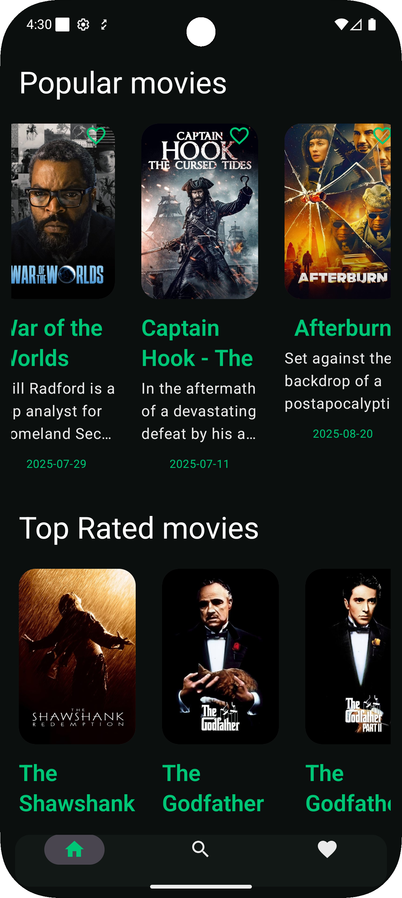

# 🎬 MovieZoneCMP

MovieZoneCMP is a **Kotlin Multiplatform** application that delivers a modern movie and TV series browsing experience.  
The app showcases a clean UI, smooth navigation, and up-to-date movie data with features like popular movies, now playing, popular series, and search.  

> **Note:** The project is still under active development — screenshots below reflect the current implemented UI and design direction.

---

## 📱 App Design Preview

| Home Screen              | Movie Details     | Details 2                       | Search |
|--------------------------|-------------------|----- Details 2 -----------------| Search |
|  |   |  | 

*(Images are from the design prototype — actual UI closely matches these)*

---

## ✨ Current Features

- **Home Screen**
  - Popular Movies section
  - Now Playing section
  - Popular Series section
- **Movie Details Screen**
  - Poster, title, rating, and release year
  - Overview description
  - Cast list with images and names
  - Buttons for *Watch Now* and *Add to Watchlist*
- **Search Screen**
  - Search by movie title
  - Recent search tags
  - Filter by genre (Comedy, Drama, Thriller, etc.)
  - Search results grid

---

## 🛠 Tech Stack

**Languages & Platforms**
- Kotlin Multiplatform (Android, iOS, Desktop)
- Swift (for iOS UI integration)
- Jetpack Compose Multiplatform

**UI & Design**
- Jetpack Compose (Android/Shared)
- Material 3 design system

**Networking & Data**
- Ktor Client – API requests
- Kotlinx Serialization – JSON parsing

**Architecture**
- MVVM pattern
- Shared business logic in `shared` module

---

## 📂 Project Structure
MovieZoneCMP/
├── composeApp/ # Shared Compose UI code
├── iosApp/ # iOS platform-specific code
├── shared/ # Shared Kotlin code (business logic, networking, models)
├── gradle/ # Gradle configuration
└── README.md
